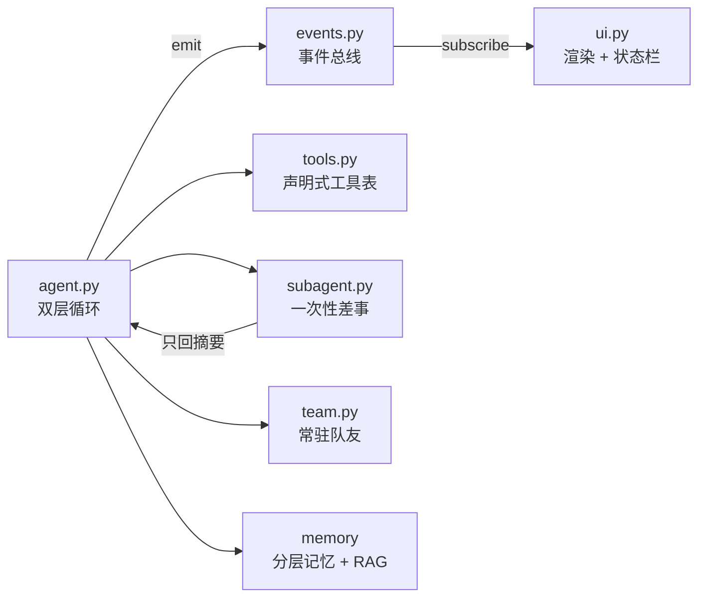

# Agent-from-scratch(demo)

> 不用 LangChain / LangGraph，用纯 Python 从零手搓一个 AI Agent —— 一个以"搞懂 Agent 到底怎么跑起来的"为目标的学习项目，而不是交付产品。


**English TL;DR**: A learning project that re-implements the core mechanisms of a modern AI agent **from scratch, with no agent framework** — only the Anthropic SDK and plain Python (~3k lines). It includes a declarative tool system with capability-driven concurrent scheduling, a todo-list state machine (plan mode), one-shot subagents and persistent teammates, an event-driven UI fully decoupled from the agent loop, layered memory with LLM-based compaction and a two-stage RAG (bi-encoder + cross-encoder rerank), a sandboxed code runner, and per-turn undo. Built to understand how agents actually work under the hood, not to ship a product.

---

## 项目简介

整个项目围绕一个经典的双层循环展开（`agent.py`）：

- **外层循环**：读用户输入 → 处理斜杠命令 → 消息入历史并落盘 → 开启本轮 undo 快照
- **内层循环**：流式调模型 → 按 `stop_reason` 分支：工具调用就分发执行、`max_tokens` 就自动续写、todo 未完就提醒续跑、连续失败 3 次就熔断
- **事件驱动**：循环里**没有一个 print**，所有输出走事件总线（9 种事件类型是稳定契约），UI 只是其中一个订阅者

在此之上，逐步长出了工具、计划、子代理、团队、记忆、RAG、沙箱、撤销等组件。

## 功能特性

### 已实现

- [X] **工具系统**：12 个客户端工具 + 1 个服务端工具（web_search）；声明式注册表单点声明，API 视图 / 能力表 / 执行体表自动派生，新增工具不用改调度器
- [X] **能力声明驱动并发**：声明了 `concurrent_safe` 的连续工具调用自动合批，进线程池并行执行；调度只看声明，不看工具名
- [X] **安全分层**：高危命令正则硬拦截 → `risk: exec` 工具执行前用户确认（y/n/a）→ 沙箱剥离密钥环境变量、无 shell 执行、超时杀进程树 → pip/npm 包名白名单
- [X] **计划模式（todolist 状态机）**：同一时间至多一项 in_progress、completed 必须从上轮 in_progress 流转（堵"没做先打勾"）、前置项未完成禁止推进；模型想收工但 todo 未完时强制续跑
- [X] **一次性子代理**：searcher / writer / coder 三种身份（各自工具白名单），多个派遣自动并发；**只回传摘要，中间过程不进主上下文**；汇报质量有校验，失败会回传结构化诊断供主 Agent 调整策略
- [X] **常驻多智能体团队（雏形）**：队友是常驻 daemon 线程，有名字、职司和状态；文件消息总线（`.team/inbox/*.jsonl`，发送=追加、读取=清空）；lead 侧 5 个团队工具动态注册进工具表
- [X] **事件驱动 UI（解耦）**：所有渲染规则从事件推导，循环对 UI 一无所知；手绘单行状态栏（模型 | token 与缓存命中 | todo 进度 | 当前活动耗时）；rich / prompt_toolkit 全部可选降级
- [X] **分层记忆**：短期对话流水 / 今日情景 / 长期 MEMORY.md / 用户画像四层；会话中途只做压缩瘦身，退出时才提取长期记忆；用户画像只以用户原话为依据（主客体分离）；琐碎会话门控跳过不调 LLM
- [X] **RAG 语义检索**：bge-m3 双塔粗筛 + bge-reranker-v2-m3 交叉编码器精排；相似度闸门防止"硬塞不相关结果诱导编造"；精排故障自动退回粗筛
- [X] **代码沙箱**：独立工作区 + 剥离 KEY/TOKEN/SECRET 的环境变量 + 依赖自动安装 + 产物清单回传
- [X] **按轮分组的撤销**：写工具落盘前自动备份，`/undo` 弹栈逆序还原（改过的字节级回填、新建的删除），撤销后同步告知模型防止它基于幻觉继续干活
- [X] **健壮性机制**：`max_tokens` 截断自动续写（带防死循环上限）、连续 3 次工具失败熔断、孤儿 tool_use 自动修补、URL 幻觉守卫
- [X] **Skill 机制（渐进式披露）**：启动只读 SKILL.md 的 front matter 登记目录，模型按需 `load_skill` 加载全文

### 待完善（说实话的部分）

- [ ] **team 协作深度**：目前是"能跑"的雏形，没有任务队列和结果追踪，队友模型还是硬编码的
- [ ] **skills/ 目录是空的**：机制完整，但还没有写出一个拿得出手的 skill 实例
- [ ] **测试缺失**：只有一个 embedding 学习脚本（`rag_test/`），没有正式测试
- [ ] **跨平台**：目前以 Windows 为主（`run_command` 走 cmd.exe、杀进程树用 taskkill）

## 快速开始

### 1. 环境准备

Python 3.10+，安装依赖：

```bash
pip install -r requirements.txt
```

### 2. 配置 API Key

进入 `config.py` 里自行配置。

项目默认使用的模型全部走 Anthropic / OpenAI 兼容端点，可按需替换成别家：

| 用途                                    | 默认模型                | 平台        |
| --------------------------------------- | ----------------------- | ----------- |
| 主模型                                  | Kimi k3                 | Moonshot    |
| 记忆整理员（压缩/提取，用便宜快的模型） | deepseek-flash          | DeepSeek    |
| Embedding（RAG）                        | BAAI/bge-m3             | SiliconFlow |
| Rerank（RAG 精排）                      | BAAI/bge-reranker-v2-m3 | SiliconFlow |

> 双模型分工是有意的：记忆压缩、提取这类格式化任务交给便宜模型做，主模型专心干活，能省下不少 token。

### 3.构建 RAG 索引（使用一段时间，有记忆了再构建）

```bash
python memory_rag.py build        # 给 memory/ 建向量索引
python memory_rag.py search 词    # 命令行测试检索效果
```

### 4. 运行

```bash
python agent.py
```

REPL 内可用的斜杠命令：

| 命令       | 作用                   |
| ---------- | ---------------------- |
| `/team`  | 查看队友名册与状态     |
| `/inbox` | 查看队友回禀           |
| `/undo`  | 撤销上一轮的文件改动   |
| `/exit`  | 退出并提取本轮长期记忆 |

## 使用示例


> 一段真实运行录屏：一句话需求 → 建 todolist → 分段写入文件 → code_sandbox 自测核心逻辑 → 交付。
> 底部状态栏实时展示 token 消耗、缓存命中与 todo 进度。

如果改完不满意：`/undo` 一键还原这一轮的所有文件改动；退出时 `/exit`，Agent 会把本轮值得记住的东西整理进长期记忆，下次启动它还记得。

## 项目结构

```
agent-from-scratch/
├── agent.py            # 入口与主循环：双层循环 + stop_reason 分支 + 熔断
├── events.py           # 事件总线（42 行）：发布/订阅，9 种事件类型契约
├── ui.py               # TUI：纯事件订阅者，手绘状态栏，依赖全部可选降级
├── config.py   # 配置模板
│
├── tools.py            # 工具系统：声明式注册表 + 权限引擎 + 并发调度
├── plan.py             # todolist 状态机：校验流转规则，堵跳步/虚假完成
├── subagent.py         # 一次性子代理：三种身份、并发派遣、汇报质量校验
├── team.py             # 常驻队友：daemon 线程 + 文件消息总线（雏形）
├── skill_loader.py     # Skill 渐进式加载：启动只读 front matter，按需读全文
├── sandbox.py          # 代码沙箱：隔离工作区 + 剥密钥 + 依赖安装
├── undo.py             # 按轮分组的撤销栈
│
├── memory.py           # 记忆存储层：只管文件 IO
├── memory_compact.py   # 记忆整理：会话中压缩 / 退出时提取 / 孤儿修补
├── memory_rag.py       # RAG 检索：向量索引 + 两段式检索（粗筛 + 精排）
│
├── templates/          # 记忆整理员的 prompt 模板（压缩 / 提取）
├── skills/             # Skill 目录（机制就绪，暂无实例）
├── make_game/          # Agent 的真实产出物：两个网页小游戏
└── rag_test/           # embedding 学习脚本（手写余弦相似度验证语义排序）
```

## 核心设计细节（造轮子过程中学到的）

### 事件驱动：循环与 UI 完全解耦

主循环里没有任何 `print`，所有输出通过 `emit()` 发到事件总线（`events.py`，42 行）。9 种事件类型（text / tool_start / tool_end / error / info / usage / todo / activity / turn_end）构成稳定契约，UI 只是一个订阅者。想换皮肤、加日志器、接 Web 前端，都不用动循环一行代码。



### 主上下文是稀缺资源

这是整个项目着墨最多的设计约束，好几处机制都是为它服务的：

- **子代理只回摘要**：探索性任务（读 N 个网页 / 跑 N 条命令）派出去，中间过程不进主 history
- **大输出自动落盘**：命令输出超过 8000 字符就写进临时文件，只回预览
- **system prompt 逐字节稳定**：Kimi 按前缀自动缓存，所以易变的时间戳放用户消息里、偶尔变的记忆放 prompt 最后——缓存命中率肉眼可见地提高
- **记忆分层**：对话流水只追加、情景按日归档、长期记忆退出时才写，各管各的

### todolist 不只是个列表，是个状态机

模型只能通过 `update_todos` 工具**全量覆盖**提交 todo，每次提交都过一遍校验：同时至多一项 in_progress；completed 必须从上轮 in_progress 流转而来（防止没做先打勾）；前置项未完成禁止推进。配合主循环的"未完续跑"——模型想收工但 todo 没勾完，就注入提醒让它继续。

### 记忆的分时机写入与主客体分离

- **中途只瘦身，退出才写长期**：会话中的 compact 只把旧消息压缩成情景段落；长期记忆和用户画像只在 `/exit` 时提取。这样避免了" Agent 自己写的总结又进入自己的上下文"造成的自我强化
- **主客体分离**：用户画像只允许以**用户原话**为依据，不许把 Agent 自己的猜测写进去
- **切点保护**：压缩的切点不能落在 tool_result 上（否则产生孤儿 tool_use，下一次请求直接 400）

### 两段式 RAG

双塔 embedding（bge-m3）余弦粗筛取 50 个候选，过 0.5 相似度闸门，再交给交叉编码器（bge-reranker-v2-m3）精排取 top_k。相似度闸门是为了防止"硬塞不相关的结果反而诱导模型编造"；精排故障时自动退回粗筛结果，不阻塞主流程。

## 局限

- 学习项目，没有测试覆盖，请别用在生产环境
- 以 Windows 为主要运行环境，其他平台未验证
- team 多智能体只是雏形，skills 还没有实例——这两块是我接下来想继续做的
- 沙箱是"工作区级隔离"，不是容器级安全沙箱，别跑不可信代码

## 技术栈

- **Python 3.10+**（无 Agent 框架，核心逻辑只用标准库 + anthropic SDK）
- **anthropic SDK**（走各家 Anthropic 兼容端点）
- requests / beautifulsoup4 / PyYAML / numpy
- rich / prompt_toolkit（可选，缺失自动降级）

## 项目缘起（碎碎念）

感谢Claude Code、Kimi Code这类成熟产品为我们提高了极大的工作、学习效率，但在使用过程中总有种"黑盒"的感觉：tool 怎么调度、上下文怎么压缩的、subagent 如何实现的、记忆是怎么写进去的，都让我非常好奇。

后来我想，搞清楚一件事最直接的办法，就是**亲手把它造一遍**。于是有了这个仓库：不依赖任何 Agent 框架，不用Langchain，只用 Anthropic SDK + Python 标准库，把一个现代 Agent 该有的零件一个个搭建出来。踩坑的过程，就是学习的过程。

所以请先说明：**这不是一个生产级框架，只是一个学习笔记性质的仓库**。代码里保留了大量"为什么这么写"的注释（包括踩坑记录），它们本身就是这个项目最想留下来的东西。范式上参考了b站up主”小单说AI“和《Alice工程论》，特此感谢。

## License

MIT
